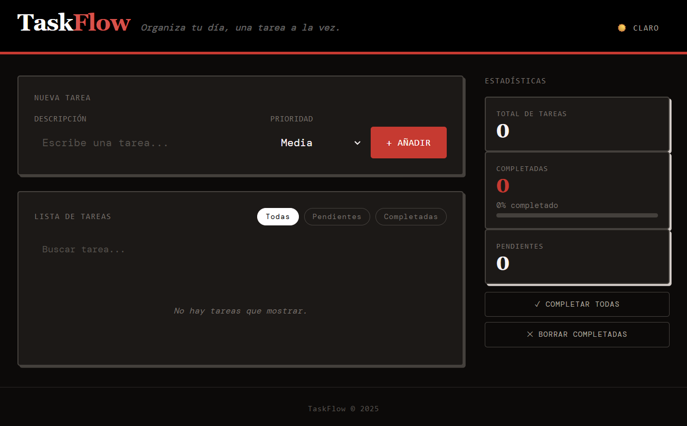

# TaskFlow 📋

> Organiza tu día, una tarea a la vez.



🌐 **Demo en vivo:** https://taskflow-project-ten.vercel.app/

---

## Descripción

TaskFlow es una aplicación web de gestión de tareas construida con tecnologías web estándar sin dependencias de frameworks. El objetivo principal era practicar HTML semántico, CSS moderno, JavaScript vanilla y las bases del desarrollo frontend profesional, incluyendo control de versiones con Git y despliegue en producción.

---

## Características

- ✅ Añadir, editar y eliminar tareas
- ✅ Prioridad por tarea: Alta, Media o Baja
- ✅ Filtros: Todas, Pendientes, Completadas
- ✅ Búsqueda de tareas en tiempo real
- ✅ Completar todas las tareas de un clic
- ✅ Borrar todas las completadas
- ✅ Estadísticas: total, completadas, pendientes y porcentaje
- ✅ Modo oscuro con detección automática del sistema
- ✅ Persistencia de datos con LocalStorage
- ✅ Diseño responsive para móvil, tablet y escritorio

---

## Tecnologías utilizadas

| Tecnología | Uso |
|------------|-----|
| HTML5 | Estructura semántica |
| CSS3 | Estilos propios, variables CSS, Flexbox |
| Tailwind CSS (CDN) | Clases utilitarias y modo oscuro |
| JavaScript (ES6+) | Lógica de la aplicación |
| LocalStorage | Persistencia de datos en el navegador |
| Git & GitHub | Control de versiones |
| Vercel | Despliegue en producción |

---

## Estructura del proyecto

```
taskflow-project/
├── index.html          # Estructura HTML semántica
├── style.css           # Estilos propios y variables CSS
├── app.js              # Lógica JavaScript completa
├── README.md           # Documentación del proyecto
├── .gitignore          # Archivos ignorados por Git
└── docs/
    └── design/
        └── wireframe.html  # Wireframe interactivo inicial
```

---

## Instalación y uso

No requiere instalación de dependencias. Solo clona el repositorio y abre el archivo en el navegador:

```bash
git clone https://github.com/AlejandroQuintanilla/taskflow-project.git
cd taskflow-project
```

También puedes acceder directamente a la demo: https://taskflow-project-ten.vercel.app/

---

## Funcionalidades detalladas

### Gestión de tareas
Cada tarea tiene: título, prioridad (alta/media/baja) y estado (pendiente/completada). Las tareas se pueden editar haciendo doble clic sobre el texto o pulsando el botón de edición. Todos los cambios se guardan automáticamente en LocalStorage.

### Filtros y búsqueda
El panel de filtros permite ver todas las tareas, solo las pendientes o solo las completadas. La barra de búsqueda filtra en tiempo real por el texto de cada tarea.

### Estadísticas
La barra lateral muestra en todo momento el total de tareas, cuántas están completadas, cuántas pendientes y el porcentaje de progreso con una barra visual.

### Modo oscuro
El botón del encabezado alterna entre modo claro y oscuro. La preferencia se guarda en LocalStorage y al cargar la app se detecta automáticamente la preferencia del sistema operativo del usuario.

---

## Accesibilidad

La aplicación ha sido auditada con Lighthouse obteniendo una puntuación de **92/100 en Accesibilidad**. Entre las medidas implementadas:

- HTML semántico con `<header>`, `<main>`, `<aside>`, `<footer>`, `<section>`
- Etiquetas `<label>` asociadas a todos los campos del formulario
- `aria-label` en botones sin texto descriptivo
- `aria-live` en la lista de tareas para lectores de pantalla
- Un único `<h1>` por página y jerarquía de encabezados correcta
- Navegación completa por teclado
- Indicadores de foco visibles

---

## Testing

| Caso de prueba | Resultado |
|----------------|-----------|
| Añadir tarea con texto y prioridad | ✅ Correcto |
| Añadir tarea con campo vacío | ✅ Muestra validación |
| Marcar tarea como completada | ✅ Correcto |
| Desmarcar tarea completada | ✅ Correcto |
| Editar tarea con doble clic | ✅ Correcto |
| Editar tarea con botón ✎ | ✅ Correcto |
| Eliminar tarea individual | ✅ Correcto |
| Filtro "Pendientes" | ✅ Correcto |
| Filtro "Completadas" | ✅ Correcto |
| Búsqueda en tiempo real | ✅ Correcto |
| Completar todas | ✅ Correcto |
| Borrar completadas | ✅ Correcto |
| Persistencia al recargar | ✅ Correcto |
| Modo oscuro y guardado | ✅ Correcto |
| Responsive en móvil | ✅ Correcto |

---

## Despliegue

El proyecto está desplegado en **Vercel** con integración continua desde GitHub. Cada push a la rama `main` genera un nuevo despliegue automático.

🌐 https://taskflow-project-ten.vercel.app/

---

*Proyecto desarrollado durante las prácticas en Corner Studio — 2025*
